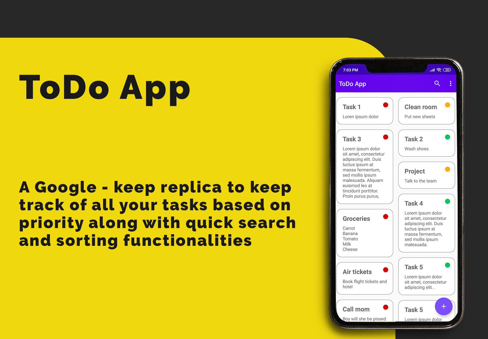

# To-do-app

A google keep based To-Do app.
With this project I have explored about using navigation graphs in android applications, using data binding that reduces amount of code written and using safe args.
The app uses a ROOM database management system and uses SafeArgs as well.

There are 3 fragments:
  1. The list fragment : This fragment implements the recycler view layout and over that I have implemented a Staggered grid view layout to give it a similar look to Google Keep
  2. The add fragment: This fragment is used to add data into the ROOM database.
  3. The update fragment: This is to update existing data in the database.
 
